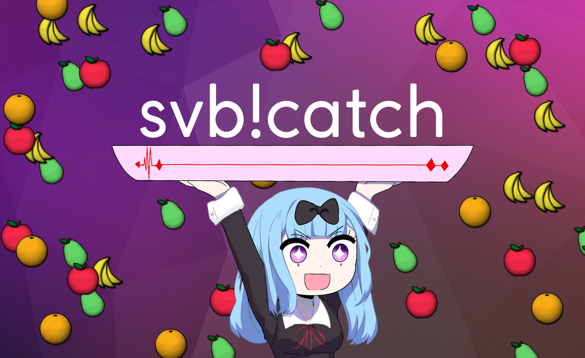

<p align="center">
  
</p>

# SVB
This repo is mostly used by me to play around with web development, for most people there is nothing of interest here. Maybe give [svb!catch](https://svb.sajber.me/catch/) a try if you're bored? SVB doesn't stand for anything special, it used to be SVT but changed due to trademark issues.

###### *Please note that this website is not affiliated with Sveriges Television AB, osu!, or any other brands you might see here in any way. If you have any questions you can [email me here](mailto:lindgrenfabian@gmail.com?subject=SVB).* 

## Parts of the website

- svb!catch
  - Rhythm minigame based on [osu!catch](https://osu.ppy.sh/wiki/en/Game_mode/osu!catch). 
  - Full support for any osu! beatmap.
  - Custom difficulty calculations to give all beatmaps (levels) their own difficulty rating
  - Logged in users receive score, ranks and performance points from playing beatmaps.

- User profiles
  - Users can sign up with their Discord accounts, which grants access to other parts of the site and lets them save statistics in svt!catch and SajberRoyale.
  - Registered users can set their own biography and banner, and gain various user badges that grants additional permissions
- News articles
  - Users with a role higher than Krönikör can create articles shown on the main page.
- Mudae statistics
  - Shows statistics from the Mudae bot on Discord. 
  - Data is sent to the website by [SaltBot](https://bots.ondiscord.xyz/bots/539453930313351168).

### Badges

- Krönikör
  
  - Default
- Reporter & Programledare
  
  - Can create articles
- Redaktör
  
  - Can edit and remove all articles
- Chefredaktör 
  - Can assign roles

## Installation

#### Prerequisites

- Node.js v12
- MySQL
```bash
git clone https://github.com/LiterallyFabian/SVB.git
cd SVB/app
npm install
node .
```
